## How to get a Pixlite16 MK2 v1.0 adaptor to work with LEDlabs

## required Componenents   
- WS2812B LEDs ( Aliexpress, Adafruit Neopixel )  
  I am using RGB LED strips with 144 LEDS per strip 
- Pixlite16 MK2 v1.0 board http://www.advateklights.com
- iPhone or iPad 
- LEDLabs iPhone app (you have to purchase the LED Display package ) 
- Wifi Router "MiniRouter"  
- Cat5 Ethernet cable 
- Macbook 
- Advatek Assistant software   

### Setup steps 
- Start your router and identify network address ( mine: 192.168.100.100 ) 
- Plug the Ethernet cable to the router 
- Plug the other end of the Ethernet cable into the silver Pixlite16 network outlet ( do NOT use the DMX output) 
- Start your Macbook and install the Advatek Assistant Software 
- Connect Macbook to the Wifi Router network "MiniRouter" 
- Start the Advatek Assistant software 

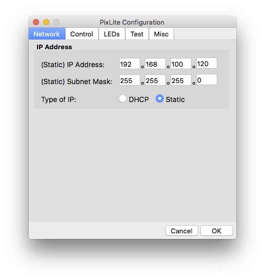
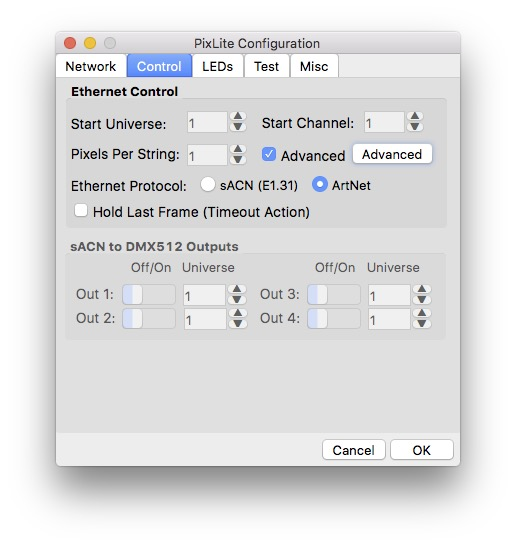 

### Below the working config 
This config fixes the DEAD PIXELS problem I mentioned below.
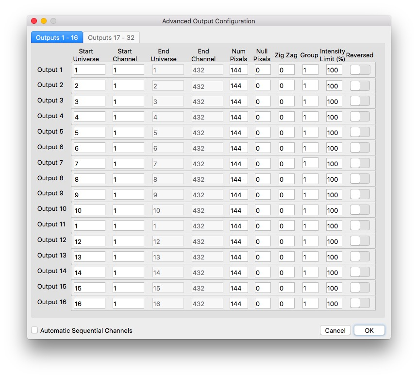 

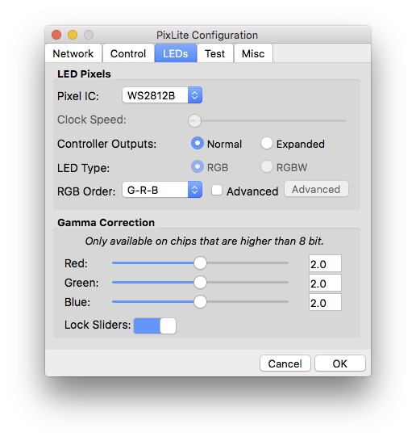
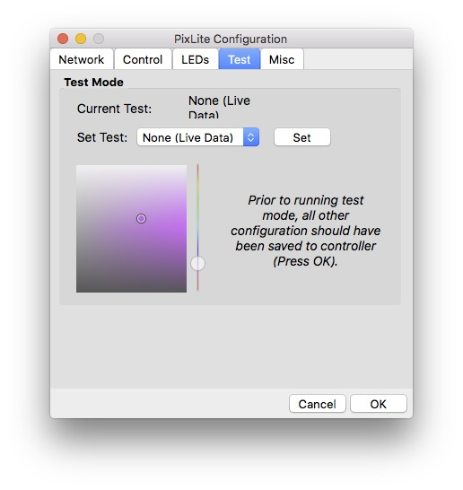
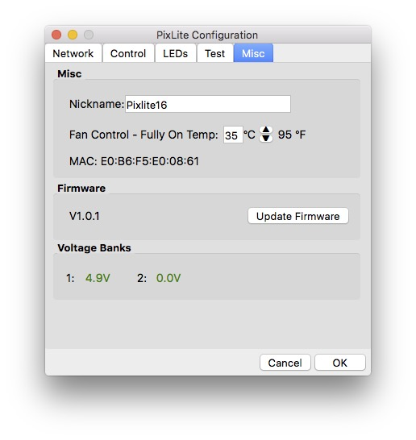

## LED Labs configuration 

### Setup Controller in LEDlabs  
Here are the steps I perform on the iPad:

- I connected the iPad the the MiniRouter WIFI network
- I start LEDlabs on the iPad
- I purchase the LED Mapping package from LEDlabs to see the output 
- I enter the configuration menu *LED Setup*
- As it's artnet, there's no controller self-discovery. I will configure this manually 
  - Make sure "Artnet Keep Controller list Synced" is deactivated 
  - Press New 
  - Select new artnet controller
  - Enter the IP address of the new controller ( This is shown in the Advatek Assistant window - by the way i am using a static IP for the Pixlite16 to not confuse things further ... )  
  - Enter the nunber of LEDs per strand - make sure this is CORRECT !!! 
  - enter the number of outputs ( = strips ) 

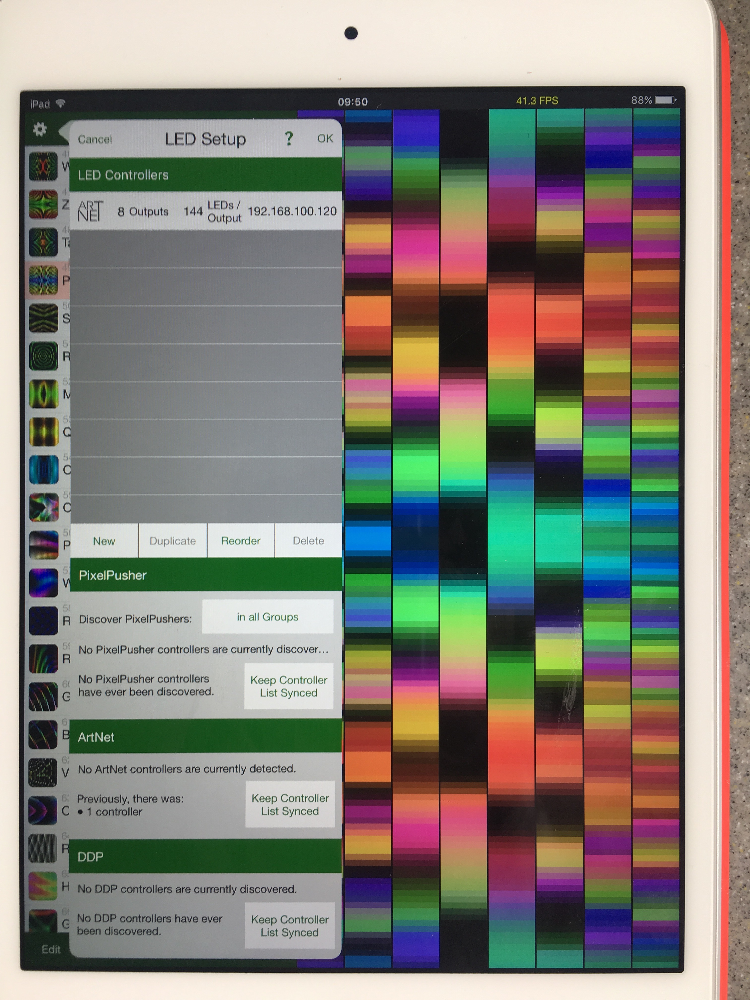 

### Setup Controller in LEDlabs   
Configure the Mapping in LEDlabs 

- purchase the mapping package 
- restore purchase if needed 
- I am using a simple strips layout with a 8x144 pixel matrix 

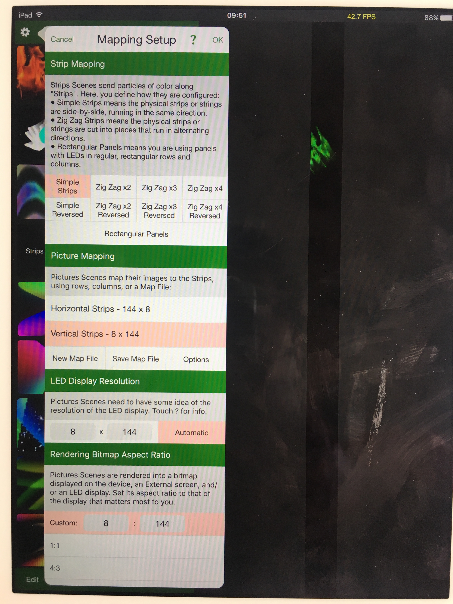 

### Issue with the driven pixels 

No matter what LEDLabs scene I use, I see that the same pixels are blacked out. 

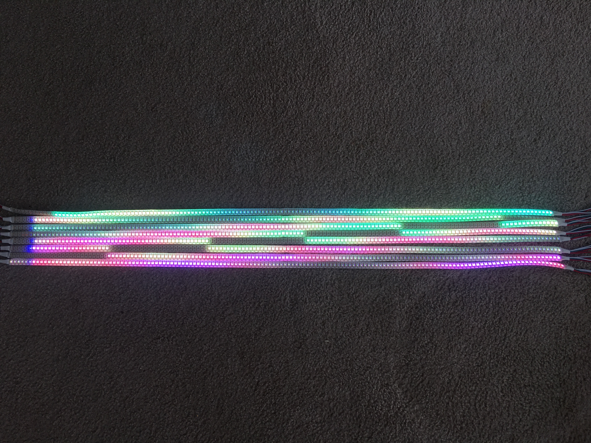 

### Syncronized pic between LEDlabs and Strips 
The picture below demostrates what LEDlabs wants to show (LED Preview on the iPad), and what's currently displyaed with the Strips. I see blacked out LEDs on the strips, *no matter what LED scene I use*.

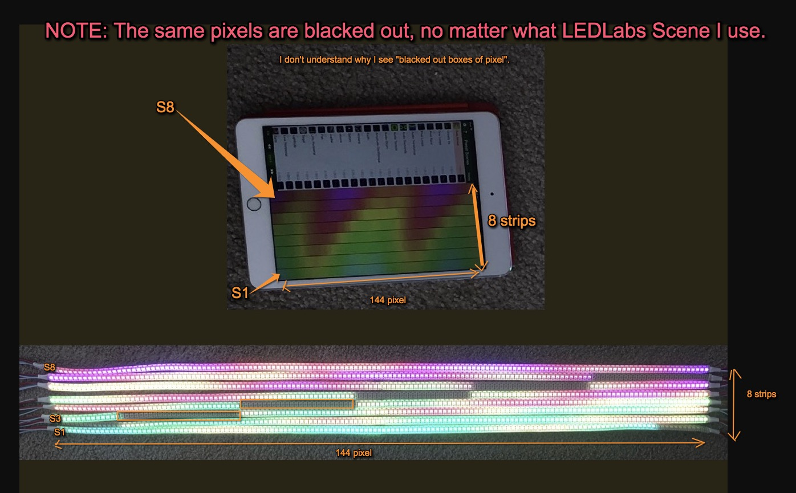

### Incorrect config
The issue with LEDlabs got resolved (thanks Advatek support ! ). The problem is that LEDlabs assuems that every single LED strand is a single,sepaarte universe. So every strand needs to start at a new universe with pixel start #1 

 If you configure Advatek assistant like below, you see the dead pixles. *dont do that* 

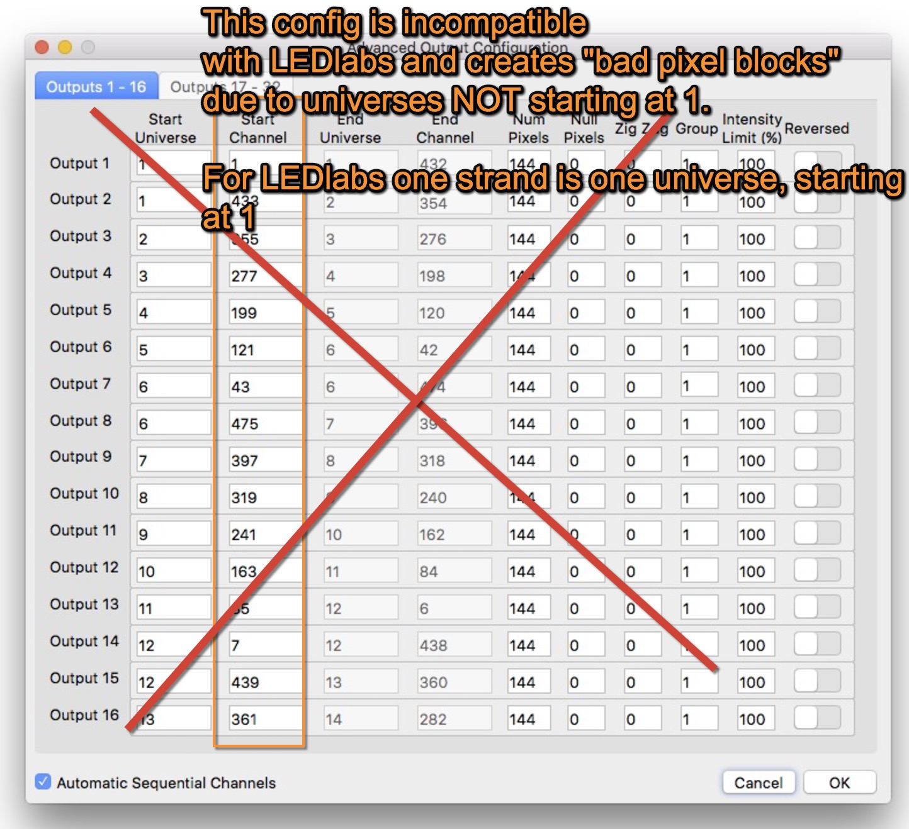
