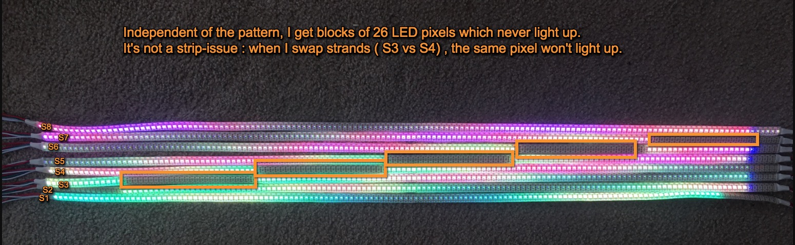

## How to get a Pixlite16 MK2 v1.0 adaptor to work with LEDlabs

## required Componenents   
- WS2812B LEDs ( Aliexpress, Adafruit Neopixel )  
  I am using RGB LED strips with 144 LEDS per strip 
- Pixlite16 MK2 v1.0 board http://www.advateklights.com
- iPhone or iPad 
- LEDLabs iPhone app (you have to purchase the LED Display package ) 
- Wifi Router "MiniRouter"  
- Cat5 Ethernet cable 
- Macbook 
- Advatek Assistant software   

### Setup steps 
- Start your router and identify network address ( mine: 192.168.100.100 ) 
- Plug the Ethernet cable to the router 
- Plug the other end of the Ethernet cable into the silver Pixlite16 network outlet ( do NOT use the DMX output) 
- Start your Macbook and install the Advatek Assistant Software 
- Connect Macbook to the Wifi Router network "MiniRouter" 
- Start the Advatek Assistant software 

